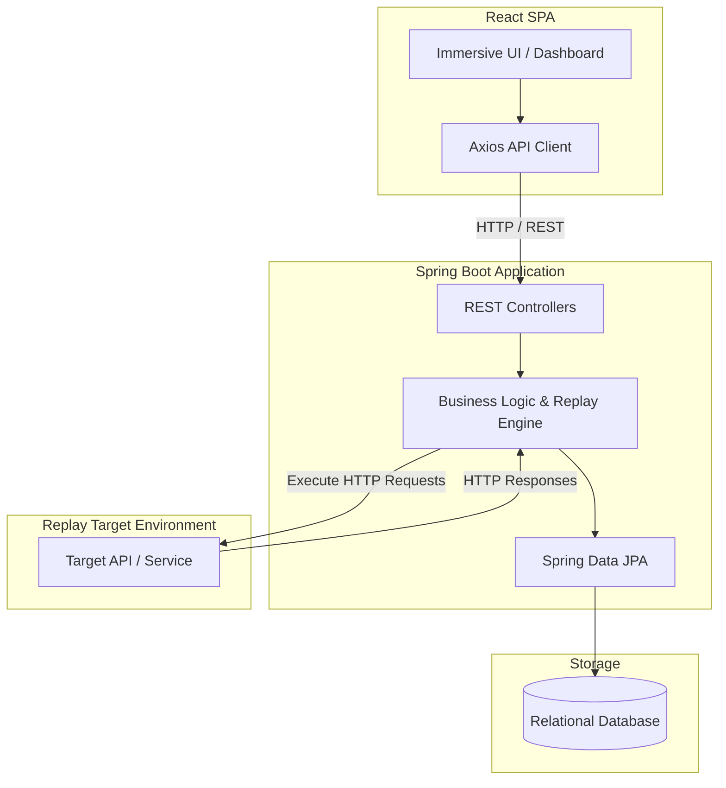
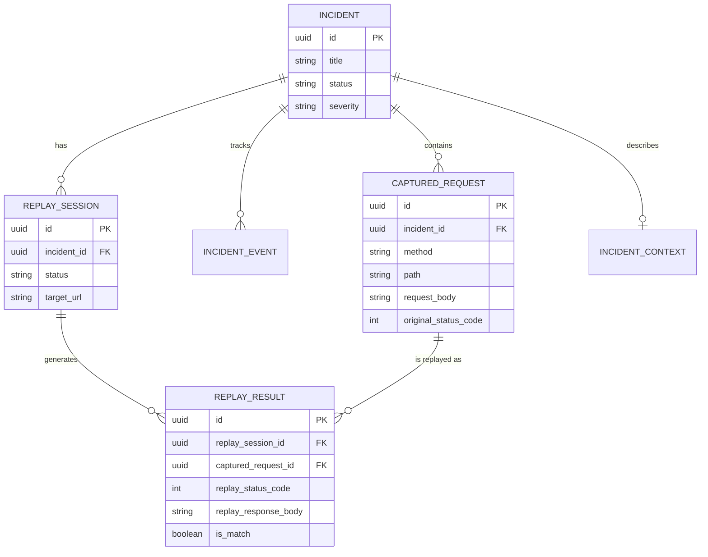

# IncidentReplay


**IncidentReplay** is a premium developer observability and debugging platform. It allows engineering teams to capture, replay, and analyze HTTP traffic associated with production incidents. By recording the exact HTTP requests that occurred during an outage or bug, developers can seamlessly replay those requests against local or staging environments to reproduce issues, verify fixes, and ensure system stability before deploying back to production.

---

## 📖 The Problem It Solves

When an incident occurs in production, reproducing the exact state and request flow is notoriously difficult. Developers often rely on logs to manually reconstruct `curl` commands or Postman collections.

**IncidentReplay** automates this by providing a unified interface to:
1. **Capture** the exact HTTP requests (headers, body, original status codes) that triggered the bug.
2. **Replay** those requests en masse against a localized or patched service.
3. **Compare** the original production response with the newly replayed response to mathematically verify that the bug is fixed.

---

## 🚀 Key Features

*   **Incident Context Management**: Group captured requests logically under specific Incidents with severity, affected services, and contextual descriptions.
*   **Intelligent HTTP Replay Engine**: Asynchronously execute batch replays of captured requests against any target URL (e.g., `http://localhost:8081`).
*   **Deterministic Response Comparison**: Diff the Original Response against the Replay Response to immediately spot regressions or confirm fixes (Status Code matching, Body exact matching).
*   **Replay Sessions & History**: Maintain a strict, immutable history of all replay attempts. Know exactly when a replay was run and what its results were.
*   **Incident Event Timeline**: A comprehensive audit trail (Timeline) of everything that occurred during an incident's lifecycle.
*   **Immersive, Cinematic UI**: A highly polished, hardware-accelerated frontend that visually represents data flow, network packets, and system heartbeats in real-time.

---

## 🏗️ Architecture & Implementation Details

IncidentReplay is built using a modern decoupled architecture:

### High-Level Architecture Diagram



### 1. The Backend (Spring Boot)
The core engine is built with Java and Spring Boot. It uses a clean, layered architecture:
*   **Controllers**: Expose RESTful APIs for the frontend.
*   **Services**: Handle complex business logic (e.g., `ReplayService` executes HTTP requests using `RestTemplate` or `WebClient`, calculates execution times, and maps responses).
*   **Data Models**: Strongly typed JPA Entities (`Incident`, `CapturedRequest`, `ReplaySession`, `ReplayResult`, `IncidentEvent`).
*   **Comparison Engine**: Evaluates `ReplayResult` against `CapturedRequest` to calculate `overallMatch`, `statusCodeMatch`, and `bodyMatch`.

### 2. The Frontend (React + Vite)
The frontend is a React application built for extreme performance and aesthetics:
*   **Immersive Shell**: Rejects standard "dashboard box" designs in favor of a translucent, glass-morphic UI that blends into an animated background.
*   **CSS-Driven Background Engine**: The animated background uses raw SVGs and CSS variables to simulate a live distributed system. It tracks request paths, responses, data flow dashes, and incident node pulses without running expensive React renders.
*   **Responsive & Reduced Motion**: Automatically disables continuous animations if the OS requests reduced motion.

### 3. The Replay Target
The project includes a configurable dummy target service (Node.js/Express) located in `replay-target/`. This provides a sandbox to instantly test out replay capabilities without risking actual infrastructure.

---

## 🗄️ Database Schema Diagram



---

## ⚙️ Running the Project

### Prerequisites
- Java 17+
- Maven
- Node.js 18+ (for frontend and target server)
- Docker (optional, for running the target server)

### 1. Start the Backend
Navigate to the root directory and run the Spring Boot application:
```bash
mvn spring-boot:run
```
*(The backend runs on http://localhost:8080)*

### 2. Start the Frontend
Navigate to the `frontend/` directory, install dependencies, and start the Vite dev server:
```bash
cd frontend
npm install
npm run dev
```
*(The frontend runs on http://localhost:5173)*

### 3. Start the Replay Target (Sandbox)
Navigate to the `replay-target/` directory and run the dummy server:
```bash
cd replay-target
npm install
node server.js
# OR using Docker:
# docker-compose up
```
*(The target server runs on http://localhost:8081)*

---

## 🎨 Design Philosophy
IncidentReplay was designed with the mindset that internal developer tools should not look boring. The UI leverages:
*   **Cinematic Dark Mode**: High-contrast, glowing accents (cyan, amber, red, green).
*   **Micro-interactions**: Sweeping gradients on hover, satisfying tab transitions, and pulsing loader states.
*   **Visual Storytelling**: The background literally illustrates what the platform does—packets traveling across a network, hitting a target, and bouncing back as responses.

---

## 📝 License
This project is open-source and available under the MIT License.
